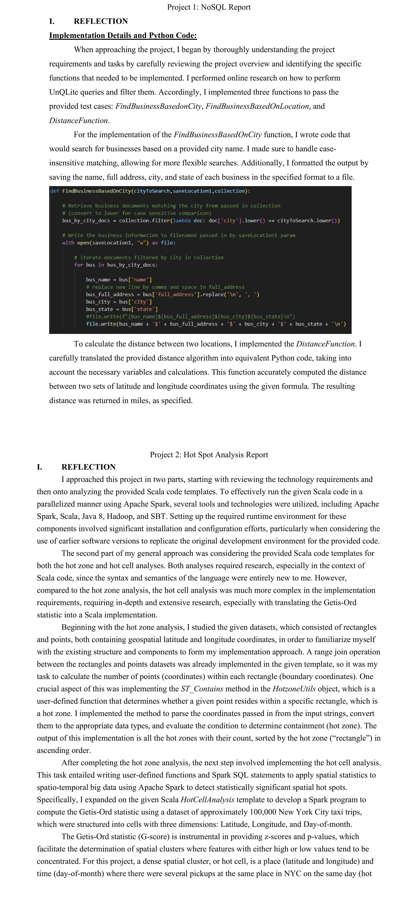

# Hot Spot Analysis Project

## Overview
This project demonstrates the implementation of large-scale spatial data analysis workflows using Apache Spark and Scala. It includes two main components:

- **Hot Zone Analysis**: Identifies regions with high densities of point data using spatial joins.
- **Hot Cell Analysis**: Calculates statistically significant spatio-temporal hot spots using the Getis-Ord statistic.

This repository showcases my experience working with big data frameworks, geospatial queries, and distributed computation.

---

## Technologies Used
- Scala
- Apache Spark
- SparkSQL
- Java
- Hadoop

---

## Project Structure

| File                                      | Purpose |
|-------------------------------------------|---------|
| `Entrance.scala`                          | Main entry point coordinating tasks and parameters |
| `Entrance.scala.continuous`               | Alternate or intermediate logic versions |
| `Entrance.scala.continuous.hotcell`       | Partial implementation for hot cell analysis |
| `Entrance.scala.continuous.hotzone`       | Partial implementation for hot zone analysis |
| `Entrance.scala.orig`                     | Original baseline version |
| `HotcellAnalysis.scala`                   | Core logic for calculating Getis-Ord statistics |
| `HotcellUtils.scala`                      | Helper methods for hot cell analysis |
| `HotzoneAnalysis.scala`                   | Core logic for performing spatial joins |
| `HotzoneUtils.scala`                      | Helper methods for hot zone analysis |

> **Note:** This code is redacted and not compilable. It is provided for illustration of design approach and project structure.

---

## Screenshot
Below is a screenshot of the project directory:

---

## Key Concepts Demonstrated
- Distributed geospatial analysis with Spark
- Range joins for spatial queries
- Calculation of spatial statistical measures (Getis-Ord G score)
- Scala functional programming for big data workflows

---

## Important Notes
- This repository contains partial code intended for demonstration purposes only.
- No datasets are included.
- The code is not fully executable without additional components.

---

## License
This project is shared for educational and portfolio purposes only. No warranty is provided.
